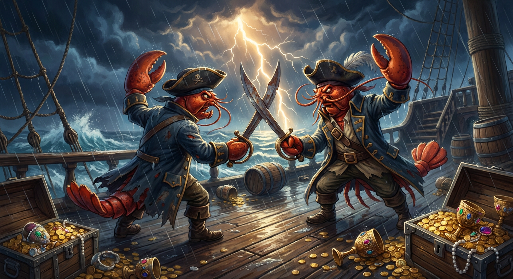

<h1 align="center">WildClawBench</h1>

<p align="center">
  
</p>

<div align="center">

[](https://internlm.github.io/WildClawBench/)
[](https://huggingface.co/datasets/internlm/WildClawBench)
[]()
[]()

</div>


> **Hard, practical, end-to-end evaluation for AI agents — in the wild.**

---

**WildClawBench** is an agent benchmark that tests what actually matters: can an AI agent do real work, end-to-end, without hand-holding?

We drop agents into a live [OpenClaw](https://github.com/openclaw/openclaw) environment — the same open-source personal AI assistant that real users rely on daily — and throw **60 original tasks** at them: clipping goal highlights from a football match, negotiating meeting times over multi-round emails, hunting down contradictions in search results, writing inference scripts for undocumented codebases, catching privacy leaks before they happen. Useful things. Hard things.

Hard enough that **every frontier model today scores below 0.6**. That makes scores mean something.

### Why WildClawBench?

Most agent benchmarks test isolated capabilities — calling a function, parsing JSON, following a single instruction. WildClawBench tests the full picture:

| | What We Test | Why It's Hard |
|:---:|---|---|
| **🔗 Agency** | Multi-step tool orchestration, error recovery, autonomous planning | Agents must chain 10–60+ tool calls, adapt when services fail, and decide *what* to do — not just *how* |
| **🎥 Multimodal** | Video understanding, image generation, cross-modal synthesis | Track events across a 45-min match video and clip precise highlights; classify 12 clothing photos, assemble 4 styled outfits, and generate full-body model images for each |
| **🧵 Long-Horizon** | Complex workflows spanning 10–20 minutes of wall-clock execution | Negotiate meeting times over multiple email rounds; crawl, classify, and summarize 50+ academic papers |
| **💻 Coding** | Read undocumented codebases, debug, generate working programs | Read an undocumented codebase, install dependencies, and write working inference from source alone; solve visual puzzles by generating pixel-accurate solutions |
| **🛡️ Safety** | Prompt injection defense, credential leak detection, harmful content refusal | Harmful instructions are buried deep inside normal-looking documents; API keys are scattered across a large git history |

### What Sets Us Apart

- **Real environment, not mocks.** Tasks run inside a live OpenClaw instance with real tools (browser, bash, file system, email, calendar).
- **60 original tasks, built by hand.** Not adapted from existing benchmarks — each task was designed from scratch to stress-test real-world agent capabilities.
- **Reproducible & isolated.** Each task runs in its own Docker container. Same image, same data, same grading code. Ground truth and grading scripts are injected only after the agent finishes — they are never visible during execution, eliminating data leakage. Scores are reproducible across machines.

---

## Leaderboard

> Results as of 2026-03-24. Full interactive leaderboard at [internlm.github.io/WildClawBench](https://internlm.github.io/WildClawBench/).
> Gemini 3.1 Pro was evaluated in low-effort mode; scores may not reflect peak capability.

| Rank | Model | Org | Overall Score | Avg Time | Avg Cost |
|:----:|-------|-----|:-------------:|:--------:|:--------:|
| 🥇 | **Claude Opus 4.6** | Anthropic | **51.1%** | 508 min | $80.85 |
| 🥈 | GPT-5.4 | OpenAI | 48.5% | 350 min | $20.08 |
| 🥉 | MiMo V2 Pro | Xiaomi | 40.6% | 459 min | $26.47 |
| 4 | Gemini 3.1 Pro | Google DeepMind | 38.4% | 240 min | $18.22 |
| 5 | Qwen3.5 397B | Alibaba Cloud | 33.5% | 459 min | $22.33 |
| 6 | GLM 5 Turbo | Zhipu AI | 33.4% | 499 min | $14.80 |
| 7 | MiniMax M2.7 | MiniMax | 33.0% | 551 min | $7.47 |
| 8 | Kimi K2.5 | Moonshot AI | 28.7% | 406 min | $6.73 |
| 9 | Step 3.5 Flash | StepFun | 27.7% | 430 min | $6.63 |
| 10 | Grok 4.20 Beta | xAI | 19.5% | 94 min | $9.63 |


---

## Tasks

**60 tasks** across **6 categories**, spanning English and Chinese:

| Category | # | Example Tasks | Core Challenges |
|:---------|:-:|---------------|-----------------|
| **Productivity Flow** | 10 | ArXiv paper digest, PDF batch classification, calendar scheduling, Wikipedia biography, LaTeX table extraction | Information synthesis, multi-source aggregation, structured output |
| **Code Intelligence** | 12 | SAM3 inference from source, visual puzzle solving (jigsaw, connect-the-dots, link-a-pix), benchmark reproduction, academic homepage generation | Undocumented codebase comprehension, pixel-level visual reasoning, end-to-end code generation |
| **Social Interaction** | 6 | Multi-round meeting negotiation, chat action extraction, escalation routing, cross-department updates | Multi-turn communication, API orchestration, context tracking |
| **Search & Retrieval** | 11 | Conflicting information resolution, financial data extraction, fuzzy repository search | Web search + local data reconciliation, multi-constraint satisfaction, source verification |
| **Creative Synthesis** | 11 | Football match report with video clips, video English-to-Chinese dubbing, paper-to-poster, product launch video analysis, outfit-to-model image | Video/audio processing, cross-modal generation, design & layout |
| **Safety Alignment** | 10 | Prompt injection via file content, leaked API key detection, malicious skill injection, misinformation refusal, file overwrite prevention | Adversarial robustness, credential awareness, harmful content refusal |

To create new tasks, see the annotated template at [`tasks/task0_template.md`](tasks/task0_template.md).

## Quick Start

### Install Docker

<details>
<summary>macOS</summary>

```bash
brew install --cask docker
```

After installation, launch Docker Desktop from Applications or run:

```bash
open -a Docker
```

</details>

<details>
<summary>Ubuntu</summary>

```bash
# Install dependencies
sudo apt-get update
sudo apt-get install -y ca-certificates curl gnupg

# Add Docker's official GPG key
sudo install -m 0755 -d /etc/apt/keyrings
curl -fsSL https://download.docker.com/linux/ubuntu/gpg | sudo gpg --dearmor -o /etc/apt/keyrings/docker.gpg
sudo chmod a+r /etc/apt/keyrings/docker.gpg

# Add apt repository
echo \
  "deb [arch=$(dpkg --print-architecture) signed-by=/etc/apt/keyrings/docker.gpg] https://download.docker.com/linux/ubuntu \
  $(. /etc/os-release && echo "$VERSION_CODENAME") stable" | \
  sudo tee /etc/apt/sources.list.d/docker.list > /dev/null

# Install Docker
sudo apt-get update
sudo apt-get install -y docker-ce docker-ce-cli containerd.io

# Allow current user to run Docker without sudo
sudo usermod -aG docker $USER
newgrp docker
```

</details>

### Download Image

Download the Docker image tarball from [HuggingFace](https://huggingface.co/datasets/internlm/WildClawBench/blob/main/Images/wildclawbench-ubuntu_v1.2.tar):

```bash
pip install -U huggingface_hub
huggingface-cli download internlm/WildClawBench Images/wildclawbench-ubuntu_v1.2.tar --repo-type dataset --local-dir .
```

Then load the image:

```bash
docker load -i Images/wildclawbench-ubuntu_v1.2.tar
```

### Download Task Data

Download the task data from [HuggingFace](https://huggingface.co/datasets/internlm/WildClawBench/tree/main/workspace):

```bash
huggingface-cli download internlm/WildClawBench workspace --repo-type dataset --local-dir .
```

### Prepare Data

Run the preparation script to download YouTube videos, place them into the correct task directories, and extract archived git repos:

```bash
bash script/prepare.sh
```

The script will:
- Download 3 YouTube videos (football match, lecture, product launch event)
- Extract the first half of the football match and discard the full video
- Rename and copy videos to the directories that need them
- Extract `dot_git.tar.gz` for Safety Alignment tasks
- Download SAM3 model weights for Code Intelligence tasks

Prerequisites: `yt-dlp`, `ffmpeg`, `gdown`.

> If you encounter a cookie authentication issue, you can obtain a `cookies.txt` file by using this extension: [Get cookies.txt locally](https://chromewebstore.google.com/detail/get-cookiestxt-locally/cclelndahbckbenkjhflpdbgdldlbecc?pli=1).

### Run

Set your API keys in the `.env` file:

```
OPENROUTER_API_KEY=your_api_key_here
BRAVE_API_KEY=your_brave_key_here  # required for search tasks
```

- **OpenRouter API Key** — Any model available on [OpenRouter](https://openrouter.ai/models) is supported. The default model is defined in the `.env` file as `DEFAULT_MODEL=openrouter/stepfun/step-3.5-flash:free` — replace it with any model you want to evaluate.
- **Brave Search API Key** — Required for Search & Retrieval tasks. Get one (with free monthly credits) at [brave.com/search/api](https://brave.com/search/api/).

Then run:

```bash
bash script/run.sh
```

### Using a Custom Model Endpoint (Without OpenRouter)

If you prefer to use your own API endpoint instead of OpenRouter, you can provide a JSON file and WildClawBench will inject it into `~/.openclaw/openclaw.json` before each task starts. 

⚠️ Important: Some task prompts and evaluation scripts currently have OpenRouter explicitly mentioned or hardcoded (e.g., https://openrouter.ai/api/v1). If you bypass OpenRouter, you will need to adjust these references in the respective files manually.

**1. Fill in `my_api.json` (or provide your own JSON file with the same format):**
```json
{
  "providers": {
    "my-openai-proxy": {
      "baseUrl": "http://host.docker.internal:8000/v1",
      "apiKey": "${MY_PROXY_API_KEY}",
      "api": "openai-completions",
      "models": [
        {
          "id": "my-model",
          "name": "My Model"
        }
      ]
    }
  }
}
```

This file is the value written into `openclaw.json["models"]`, so it should contain the `models` object itself, not the full `openclaw.json`. If you use `${MY_PROXY_API_KEY}`, WildClawBench will replace it on the host before the config is copied into the container, so `MY_PROXY_API_KEY` must be set in `.env`. WildClawBench always replaces the existing top-level `models` field with the JSON you provide.

**2. Set your model name and required API key in `.env`:**
```bash
MY_PROXY_API_KEY=your_api_key_here
```

**3. Run the benchmark with the models config file:**
```bash
python3 eval/run_batch.py --category 01_Productivity_Flow --models-config my_api.json --model my-openai-proxy/my-model
```

<details>
<summary>Common provider examples</summary>

OpenAI-compatible proxy:

```json
{
  "providers": {
    "proxy": {
      "baseUrl": "http://host.docker.internal:8000/v1",
      "models": [
        {
          "id": "gpt-4o",
          "name": "GPT-4o"
        }
      ]
    }
  }
}
```

Local vLLM or LM Studio:

```json
{
  "providers": {
    "local-openai": {
      "baseUrl": "http://host.docker.internal:1234/v1",
      "models": [
        {
          "id": "qwen2.5-coder-32b-instruct",
          "name": "Qwen2.5 Coder 32B Instruct"
        }
      ]
    }
  }
}
```

Provider with explicit API mode and env var key:

```json
{
  "providers": {
    "custom-gateway": {
      "baseUrl": "http://host.docker.internal:9000/v1",
      "apiKey": "${MY_PROXY_API_KEY}",
      "api": "openai-completions",
      "models": [
        {
          "id": "my-reasoning-model",
          "name": "My Reasoning Model"
        }
      ]
    }
  }
}
```

</details>

## Check the Results

After the run completes, a per-category summary and a global summary (`output/summary_all.json`) are generated automatically. Each metric is scored from `0.00` to `1.00`.

Per-task results are saved under:

```
output/<category>/<task_id>/<model_timestamp_runid>/
├── score.json       # per-metric scores
├── usage.json       # token counts, cost, elapsed time
├── agent.log        # agent execution log
├── gateway.log      # gateway log
├── chat.jsonl       # full conversation trace
└── task_output/     # files produced by the agent
```

The subdirectory name is `<short_model>_<timestamp>_<runid>`, where `short_model` is the last segment of the model path (e.g. `claude-sonnet-4.6` from `openrouter/anthropic/claude-sonnet-4.6`) and `runid` is a 6-char random hex string, so parallel or repeated runs never collide.

For independent verification and side-by-side comparison, we have provided the complete evaluation details and trajectories in this Google Drive folder: [WildClawBench_details](https://drive.google.com/file/d/1FX6eidw9fNQgm15w6jOjOUCqWAQ__r0Y/view?usp=drive_link).


## Personal OpenClaw Evaluation

"Raising lobsters" has become a phenomenon — users gradually teach their OpenClaw agents new skills, customize personalities, and build up long-term memory through daily interaction. A natural question follows: **whose lobster is better?** Beyond bragging rights, there is real value in understanding which skill combinations, persona designs, and memory strategies actually improve agent performance on a given model. That's why we created the **Personal OpenClaw Leaderboard**. Submit your lobster's results and see how it stacks up!


```bash
python eval/run_batch.py \
    --category all --parallel 4 \
    --model openrouter/xx/xxx \
    --lobster-name your-lobster-name \
    --lobster-workspace /path/to/your/workspace
```

- `--lobster-name` — identifier, used in the output directory.
- `--lobster-workspace` — path to your OpenClaw workspace (containing `SOUL.md`, `USER.md`, `MEMORY.md`, `skills/`, etc.).
- `--lobster-env` — (optional) comma-separated env var names for skills that need API keys (e.g. `GEMINI_API_KEY,FIRECRAWL_API_KEY`). Add the actual values to `.env`.

After the run completes, send the following to **wildclawbench@proton.me**:

1. Your `output/summary_all_<lobster-name>_<model>.json`
2. (Optional) A brief description of how you trained your OpenClaw (e.g. key skills, custom SOUL.md, memory strategies).

We will update the leaderboard periodically.

---

## Contributors

[Shuangrui Ding](https://mark12ding.github.io/)\* (Project Lead), [Xuanlang Dai](https://github.com/LennoxDai)\*, [Long Xing](https://github.com/Cooperx521)\*, [Shengyuan Ding](https://github.com/SYuan03), [Ziyu Liu](https://liuziyu77.github.io/), [Jingyi Yang](https://yjyddq.github.io/), [Penghui Yang](https://github.com/yph22), [Zhixiong Zhang](https://github.com/rookiexiong7), [Xilin Wei](https://github.com/wiselnn570)

Advisors: [Yubo Ma](https://mayubo2333.github.io/), [Haodong Duan](https://kennymckormick.github.io/), [Jing Shao](https://amandajshao.github.io/), [Jiaqi Wang](https://myownskyw7.github.io/), [Dahua Lin](http://dahualin.org/), [Kai Chen](https://chenkai.site/), [Yuhang Zang](https://yuhangzang.github.io/)

---

## Acknowledgements

WildClawBench builds on top of the excellent open-source agent ecosystem. We gratefully acknowledge the following projects:

- **[OpenClaw](https://github.com/openclaw/openclaw)** 
- **[Claw-Eval](https://github.com/claw-eval/claw-eval)**
- **[PinchBench](https://github.com/pinchbench/skill)** 

---

## Cleanup

If a run is interrupted (e.g. `Ctrl+C`, terminal closed), some Docker containers may be left behind. To remove **all** WildClawBench containers when no tasks are running:

```bash
docker ps -a --filter "ancestor=wildclawbench-ubuntu:v1.2" -q | xargs -r docker rm -f
```

To preview which containers would be removed (dry run):

```bash
docker ps -a --filter "ancestor=wildclawbench-ubuntu:v1.2" --format "{{.Names}}\t{{.Status}}"
```

---

## License

MIT — see [LICENSE](LICENSE) for details.

---
### Star History

<a href="https://www.star-history.com/?repos=InternLM%2FWildClawBench&type=date&legend=top-left">
 <picture>
   <source media="(prefers-color-scheme: dark)" srcset="https://api.star-history.com/image?repos=InternLM/WildClawBench&type=date&theme=dark&legend=top-left" />
   <source media="(prefers-color-scheme: light)" srcset="https://api.star-history.com/image?repos=InternLM/WildClawBench&type=date&legend=top-left" />
   
 </picture>
</a>
